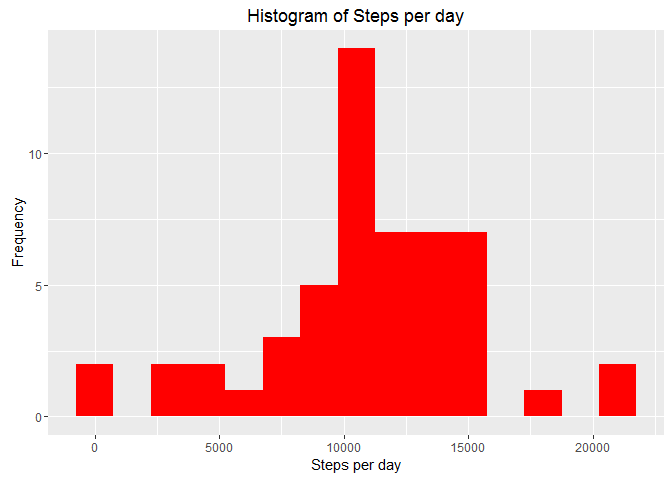
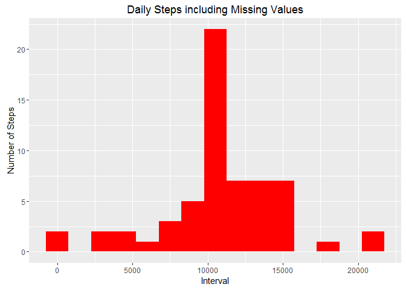
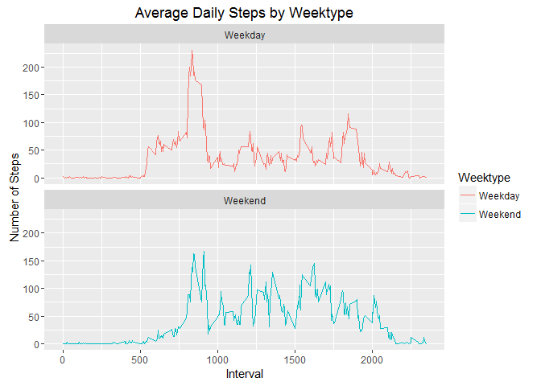

# Reproducible Research Project Assignment 1
Kevin Gunn  
June 15, 2016  

This assignment makes use of data from a personal activity monitoring device. This device collects data at 5 minute intervals throughout the day. The data consists of two months of data from an anonymous individual collected during the months of October and November, 2012 and include the number of steps taken in 5 minute intervals each day.

This document presents the results from Project Assignment 1 in the Coursera course Reproducible Research, written in a single R markdown document that can be processed by knitr and transformed into an HTML file.

##Code for reading in the dataset and/or processing the data

Show any code that is needed to load the data (i.e. read.csv())
Process/transform the data (if necessary) into a format suitable for your analysis


```r
library(knitr)
library(dplyr)
```

```
## 
## Attaching package: 'dplyr'
## 
## The following objects are masked from 'package:stats':
## 
##     filter, lag
## 
## The following objects are masked from 'package:base':
## 
##     intersect, setdiff, setequal, union
```

```r
library(ggplot2)
```

```
## Warning: package 'ggplot2' was built under R version 3.2.5
```

```r
library(rmarkdown)
```

The file activity.csv was downloaded and put in the respective folder.

```r
setwd("C:/Users/gunn/Dropbox/Reproducible Research/Project Assignment 1")
activityData <- read.csv("C:/Users/gunn/Dropbox/Reproducible Research/Project Assignment 1/activity.csv")
 

dim(activityData)
```

```
## [1] 17568     3
```

```r
summary(activityData)
```

```
##      steps                date          interval     
##  Min.   :  0.00   2012-10-01:  288   Min.   :   0.0  
##  1st Qu.:  0.00   2012-10-02:  288   1st Qu.: 588.8  
##  Median :  0.00   2012-10-03:  288   Median :1177.5  
##  Mean   : 37.38   2012-10-04:  288   Mean   :1177.5  
##  3rd Qu.: 12.00   2012-10-05:  288   3rd Qu.:1766.2  
##  Max.   :806.00   2012-10-06:  288   Max.   :2355.0  
##  NA's   :2304     (Other)   :15840
```

```r
head(activityData)
```

```
##   steps       date interval
## 1    NA 2012-10-01        0
## 2    NA 2012-10-01        5
## 3    NA 2012-10-01       10
## 4    NA 2012-10-01       15
## 5    NA 2012-10-01       20
## 6    NA 2012-10-01       25
```


###What is the total number of steps taken per day?


```r
totalSteps <- activityData %>%
  filter(!is.na(steps)) %>%
  group_by(date) %>%
  summarize(steps = sum(steps, na.rm=TRUE))
totalSteps
```

```
## Source: local data frame [53 x 2]
## 
##          date steps
##        (fctr) (int)
## 1  2012-10-02   126
## 2  2012-10-03 11352
## 3  2012-10-04 12116
## 4  2012-10-05 13294
## 5  2012-10-06 15420
## 6  2012-10-07 11015
## 7  2012-10-09 12811
## 8  2012-10-10  9900
## 9  2012-10-11 10304
## 10 2012-10-12 17382
## ..        ...   ...
```

###Make a histogram of the total number of steps taken each day


```r
ggplot(totalSteps, aes(x=steps)) +
  geom_histogram(fill="red", binwidth = 1500) +
  labs(title="Histogram of Steps per day", x = "Steps per day", y = "Frequency")
```

 

###Calculate and report the mean and median of the total number of steps taken per day


```r
meanSteps <- mean(totalSteps$steps, na.rm = TRUE)
medianSteps <- median(totalSteps$steps, na.rm = TRUE)

meanSteps
```

```
## [1] 10766.19
```

```r
medianSteps
```

```
## [1] 10765
```
Mean steps are 10766 and median steps are 10765.

###What is the average daily activity pattern?

Make a time series plot (i.e. type = "1") of the 5-minute interval (x-axis) and the average number of steps taken, averaged across all days (y-axis). 


```r
interval<- activityData %>%
        group_by(interval)%>%
        filter(!is.na(steps))%>%
        summarize(steps = mean(steps, na.rm=TRUE))

ggplot(interval, aes(x=interval, y=steps)) +
  geom_line(color = "red")
```

 
Which 5-minute interval, on average across all the days in the dataset, contains the maximum number of steps?


```r
interval[which.max(interval$steps),]
```

```
## Source: local data frame [1 x 2]
## 
##   interval    steps
##      (int)    (dbl)
## 1      835 206.1698
```

The interval 835 has the highest number of steps with 206 steps.

###Imputing missing values

Calculate and report the total number of missing values in the dataset (i.e. the total number of rows with NAs)


```r
sum(is.na(activityData$steps))
```

```
## [1] 2304
```
Missing values are 2304.


Devise a strategy for filling in all of the missing values in the dataset. The strategy does not need to be sophisticated. For example, you could use the mean/median for that day, or the mean for that 5-minute interval, etc. 


```r
dataComplete <- activityData
nas <- is.na(dataComplete$steps)
avgInterval <- tapply(dataComplete$steps, dataComplete$interval, mean, na.rm=TRUE, simplify=TRUE)
dataComplete$steps[nas] <- avgInterval[as.character(dataComplete$interval[nas])]
names(dataComplete)
```

```
## [1] "steps"    "date"     "interval"
```

Create a new dataset that is equal to the original dataset but with the missing data filled in.

###Check for no missing values

```r
sum(is.na(dataComplete))
```

```
## [1] 0
```
Reorder columns

```r
dataComplete <- dataComplete[, c("date", "interval", "steps")]
head(dataComplete)
```

```
##         date interval     steps
## 1 2012-10-01        0 1.7169811
## 2 2012-10-01        5 0.3396226
## 3 2012-10-01       10 0.1320755
## 4 2012-10-01       15 0.1509434
## 5 2012-10-01       20 0.0754717
## 6 2012-10-01       25 2.0943396
```


Make a histogram of the total number of steps taken each day and Calculate and report the mean and median total number of steps taken per day. Do these values differ from the estimates from the first part of the assignment? What is the impact of inputing missing data on the estimates of the total daily number of steps?


```r
totalSteps <- dataComplete %>%
  filter(!is.na(steps)) %>%
  group_by(date) %>%
  summarize(totalSteps = sum(steps, na.rm = TRUE))
totalSteps
```

```
## Source: local data frame [61 x 2]
## 
##          date totalSteps
##        (fctr)      (dbl)
## 1  2012-10-01   10766.19
## 2  2012-10-02     126.00
## 3  2012-10-03   11352.00
## 4  2012-10-04   12116.00
## 5  2012-10-05   13294.00
## 6  2012-10-06   15420.00
## 7  2012-10-07   11015.00
## 8  2012-10-08   10766.19
## 9  2012-10-09   12811.00
## 10 2012-10-10    9900.00
## ..        ...        ...
```

```r
ggplot(totalSteps, aes(x=totalSteps)) +
  geom_histogram(fill = "red", binwidth = 1500) +
  labs(title = "Daily Steps including Missing Values", x = "Interval", y = "Number of Steps")
```

 
Calculate the mean and median steps with the filled in values


```r
meanStepsTotal <- mean(totalSteps$totalSteps, na.rm = TRUE)
medianStepsTotal <- median(totalSteps$totalSteps, na.rm = TRUE)

meanStepsTotal
```

```
## [1] 10766.19
```

```r
medianStepsTotal
```

```
## [1] 10766.19
```

The impact of inputing missing data with the average number of steps in the same 5-min interval is that both the mean and the median are same : 10766.19

###Are there differences in activity patterns between weekdays and weekends?

For this part the weekdays() function may be of some help here. Use the dataset with the filled-in missing values for this part.

Create a new factor variable in the dataset with two levels – “weekday” and “weekend” indicating whether a given date is a weekday or weekend day.


```r
library(lubridate)

dataComplete$date <- ymd(dataComplete$date)
dataComplete <- dataComplete %>%
  mutate(Weektype = ifelse(weekdays(dataComplete$date)=="Saturday" | weekdays(dataComplete$date)=="Sunday", "Weekend", "Weekday"))

dataComplete$weektype <- NULL

head(dataComplete)
```

```
##         date interval     steps Weektype
## 1 2012-10-01        0 1.7169811  Weekday
## 2 2012-10-01        5 0.3396226  Weekday
## 3 2012-10-01       10 0.1320755  Weekday
## 4 2012-10-01       15 0.1509434  Weekday
## 5 2012-10-01       20 0.0754717  Weekday
## 6 2012-10-01       25 2.0943396  Weekday
```
Make a panel plot containing a time series plot (i.e. type = "l") of the 5-minute interval (x-axis) and the average number of steps taken, averaged across all weekday days or weekend days (y-axis). See the README file in the GitHub repository to see an example of what this plot should look like using simulated data.


```r
intervalFull <- dataComplete %>%
  group_by(interval, Weektype) %>%
  summarize(steps2 = mean(steps, na.rm=TRUE))

head(intervalFull)
```

```
## Source: local data frame [6 x 3]
## Groups: interval [3]
## 
##   interval Weektype     steps2
##      (int)    (chr)      (dbl)
## 1        0  Weekday 2.25115304
## 2        0  Weekend 0.21462264
## 3        5  Weekday 0.44528302
## 4        5  Weekend 0.04245283
## 5       10  Weekday 0.17316562
## 6       10  Weekend 0.01650943
```

```r
finalSteps <- ggplot(intervalFull, aes(x=interval, y=steps2, color = Weektype)) +
  geom_line() +
  labs(title = "Average Daily Steps by Weektype", x = "Interval", y = "Number of Steps") +
  facet_wrap(~Weektype, ncol = 1, nrow = 2)
             
print(finalSteps)
```

 

